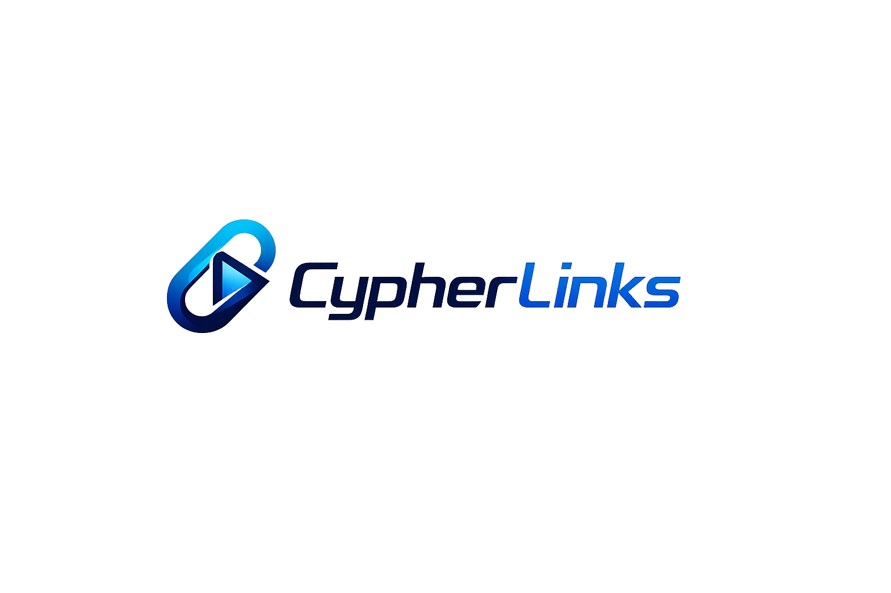
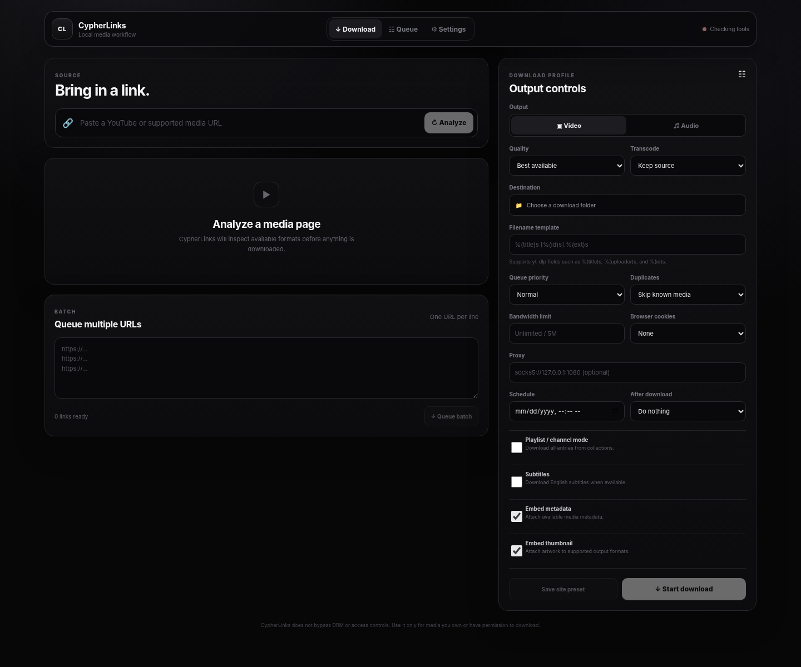

# CypherLinks

<p align="center">
  
</p>

CypherLinks is a local-first desktop application for downloading, organizing, and processing authorized online media. It combines a Tauri 2 desktop shell, a React and TypeScript interface, a Rust backend, yt-dlp for media extraction, and FFmpeg for media processing.

CypherLinks is intended for content that you own, content made available for download, public-domain media, or material you are otherwise authorized to access. The application does not implement DRM, paywall, or access-control bypass mechanisms.


## Current interface

<p align="center">
  
</p>

The desktop workspace exposes link analysis, download configuration, queue activity, media preview, browser integration, site presets, dependency controls, diagnostics, and application update controls through a single local interface.

## Key capabilities

### Media downloads

CypherLinks provides a unified workflow for individual URLs, playlists, channels, and batches of links.

- Analyze supported media URLs before downloading
- Download video or audio-only output
- Select Best, 2160p, 1440p, 1080p, 720p, 480p, or 360p when available
- Queue playlists, channels, and multiple URLs
- Download English subtitles or automatic captions when available
- Use browser cookies for content the user is authorized to access
- Embed metadata and thumbnails in supported output formats
- Configure yt-dlp filename templates
- Select destination folders through the native file picker
- Schedule downloads through the Rust queue engine
- Assign High, Normal, or Low queue priority
- Apply optional bandwidth limits
- Route supported requests through HTTP, HTTPS, or SOCKS proxies
- Choose duplicate behavior: skip, retain both copies, or overwrite
- Split chaptered media into individual files
- Resume interrupted downloads and retry transient failures
- Open completed media or its destination folder automatically

### Transcoding profiles

FFmpeg can generate an additional optimized output after the original download completes.

- **Phone** — H.264/AAC MP4 with resolution capped near 720p
- **Desktop** — high-quality H.264/AAC MP4
- **Archive** — high-quality MKV output
- **Audio Library** — AAC 256 kbps M4A
- **Keep Source** — retain the original downloaded format without additional transcoding

### Queue management and history

CypherLinks uses a native Rust queue for scheduling and download execution.

- Run between one and six concurrent downloads
- Reprioritize queued or scheduled items after submission
- View live progress, transfer speed, ETA, processing state, completion status, and errors
- Cancel queued or active downloads
- Retain local download history
- Detect previously completed media
- Preview downloaded video and audio inside the application

### Keyboard shortcuts

- **Ctrl/Command + L** — focus the URL field
- **Ctrl/Command + 1** — open Download
- **Ctrl/Command + 2** — open Queue
- **Ctrl/Command + 3** — open Settings
- **Ctrl/Command + Enter** — analyze the current URL
- **Escape** — close the active dialog
- **?** — display the shortcut reference

### Clipboard integration

Clipboard detection is available under **Settings → Clipboard detection**. When enabled, CypherLinks monitors the local clipboard for HTTP or HTTPS URLs and presents detected links in the Download workspace.

Clipboard contents are never downloaded automatically. The user must explicitly submit a detected URL.

### Browser extension

The `browser-extension/` directory contains a Chromium Manifest V3 extension that forwards the active tab or a selected context-menu link to the CypherLinks desktop application through a localhost-only bridge at `127.0.0.1:47653`.

To install the extension in Chrome or Microsoft Edge:

1. Start CypherLinks.
2. Open **Settings → Browser extension → Open extension folder**.
3. Open the browser's Extensions page.
4. Enable **Developer mode**.
5. Select **Load unpacked**.
6. Choose the `browser-extension` directory.

After installation, use the CypherLinks extension button or the browser context menu to send a page or link directly to the desktop application.

### Per-site presets

Download profiles can be saved by hostname. After configuring a profile, select **Save site preset**. When a URL from the same hostname is analyzed later, CypherLinks automatically applies the saved profile.

Saved profiles can be reviewed, applied, updated, or removed under **Settings → Site presets**. Proxy credentials and proxy addresses are intentionally excluded from saved site presets.

## Production readiness

CypherLinks includes a production-oriented desktop reliability layer:

- First-run onboarding with automatic yt-dlp and FFmpeg readiness checks
- Guided dependency installation when required tools are unavailable
- Drag-and-drop ingestion for URL files, text files containing links, and local media
- Keyboard navigation for URL focus, primary tabs, analysis, and dialog dismissal
- Local crash diagnostics with an explicit diagnostics-folder control
- Improved loading, empty, retry, and error-reporting states
- Branded application and installer icons for Windows, macOS, and Linux bundles
- Tauri signed-update integration with automatic update checks and verified installation
- Windows CI that builds the Tauri executable and performs a startup smoke test

Update signing secrets are intentionally not stored in the repository. See `RELEASE_SIGNING.md` for the production release procedure.

## System requirements

CypherLinks requires the following software:

1. Node.js 20 or later
2. Rust stable toolchain
3. yt-dlp
4. FFmpeg
5. Tauri platform-specific build dependencies

## Installation

### Windows

Run the included PowerShell setup helper:

```powershell
./setup-windows.ps1
```

The required tools can also be installed manually:

```powershell
winget install OpenJS.NodeJS.LTS
winget install Rustlang.Rustup
winget install yt-dlp.yt-dlp
winget install Gyan.FFmpeg
```

Microsoft C++ Build Tools may also be required for Tauri desktop compilation.

### macOS

Run the included setup helper:

```bash
./setup-macos.sh
```

Alternatively, install the dependencies manually:

```bash
xcode-select --install
brew install node rust yt-dlp ffmpeg
```

### Debian and Ubuntu

```bash
sudo apt update
sudo apt install -y build-essential curl wget file libwebkit2gtk-4.1-dev libappindicator3-dev librsvg2-dev patchelf ffmpeg python3-pip
curl --proto '=https' --tlsv1.2 -sSf https://sh.rustup.rs | sh
python3 -m pip install --user -U yt-dlp
```

## Development

Install JavaScript dependencies and start the Tauri development application:

```bash
npm install
npm run tauri dev
```

## Production builds

Create a platform-specific desktop bundle with:

```bash
npm run tauri build
```

Generated installers and application bundles are written to:

```text
src-tauri/target/release/bundle/
```

## Architecture

```text
React + TypeScript frontend
        │
        │ Tauri commands and events
        ▼
Rust desktop backend
  ├── media metadata analysis
  ├── priority and scheduling queue
  ├── progress reporting and cancellation
  ├── clipboard integration
  ├── localhost browser-extension bridge
  ├── local file operations
  └── dependency management
        │
        ├── yt-dlp
        │    ├── media extraction and format selection
        │    ├── playlists and channels
        │    ├── subtitles and metadata
        │    ├── cookies and proxy support
        │    └── retry, resume, and archive behavior
        │
        └── FFmpeg
             ├── stream merging
             ├── audio extraction
             ├── chapter splitting
             └── transcoding profiles
```

## Repository structure

```text
src/                    React and TypeScript frontend
src-tauri/              Rust and Tauri desktop backend
browser-extension/      Chromium browser extension
setup-windows.ps1       Windows dependency setup helper
setup-macos.sh           macOS dependency setup helper
```

## Local data and privacy

CypherLinks is designed as a local-first application. Download execution, queue state, media processing, clipboard integration, and local history remain on the user's device unless a requested media source or configured proxy requires an external network connection.

The browser extension communicates with the desktop application only through the local loopback interface. Users should review any third-party site terms and applicable permissions before downloading content.

## Security and authorized use

CypherLinks does not provide functionality to bypass DRM, paywalls, account authorization, or other access-control systems. Browser-cookie support is intended only for content the user is already authorized to access through their own browser session.

Users are responsible for ensuring that downloads comply with applicable law, platform terms, licensing conditions, and content-owner permissions.

## Validation

The TypeScript/TSX source, extension JavaScript, and JSON configuration can be validated independently of platform-specific desktop dependencies. A complete native Tauri build additionally requires the Rust toolchain and the operating-system dependencies listed above.

## Automation and resilience

CypherLinks includes a native automation layer for repeatable workflows and resilient long-running queues.

- **Download rules** apply quality, mode, priority, transfer limits, and transcoding defaults to matching domains.
- **Per-domain limits** override global bandwidth caps for selected hosts.
- **Automatic format fallback** prefers requested codecs and resolution, then falls back to the best compatible stream when the preferred combination is unavailable.
- **Queue persistence** stores waiting and scheduled jobs in the application data directory and restores them after a restart.
- **SHA-256 verification** can validate the final downloaded or transcoded file against an expected checksum.
- **Settings import/export** moves runtime rules, domain limits, provider adapters, and telemetry preferences between installations.
- **Portable mode** stores runtime state beside the executable when `portable.flag` is enabled.
- **Provider adapters** attach host-specific yt-dlp arguments without modifying the core downloader.
- **Local REST API and CLI** support localhost automation and headless scripted downloads. See `API.md`.
- **History search and filters** make completed, failed, queued, and scheduled jobs easier to locate.
- **Telemetry is opt-in** and records only coarse release counters; sharing is a separate explicit action, and URLs, titles, filenames, hostnames, and media metadata are excluded.

### Privacy model

CypherLinks is local-first. Runtime configuration, queue state, diagnostics, and history remain on the device. Opt-in telemetry counters remain local unless the user explicitly selects the sharing action in a release configured with a telemetry endpoint. The localhost API binds only to `127.0.0.1`. Provider credentials should not be embedded in provider-adapter arguments or committed to source control.
